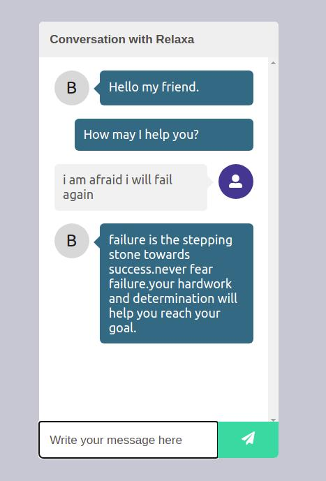

# Chatbot

# How to run the project

**Running Backend Service:**
	
    • Go to the directory /src/chatbot-backend
    • Type python api.py
	
**Running React Frontend:**

    • Go to the root directory
    • Type npm install
    • Type npm start
